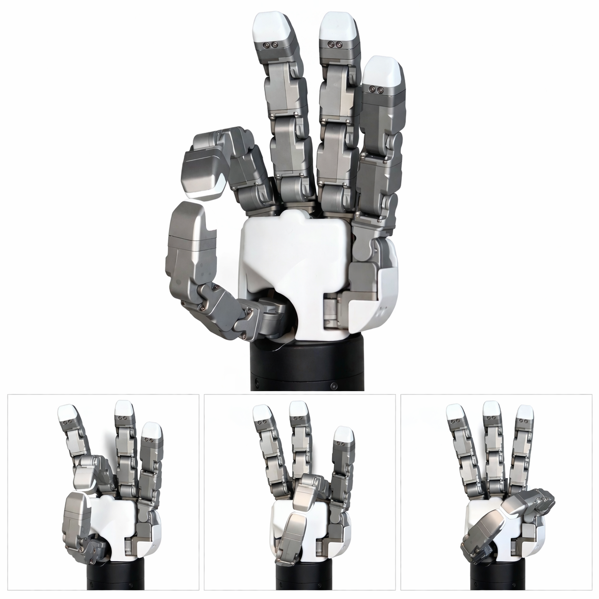

# Robot Hand Mapper (RHM)

The RobotHandMapper (RHM) retargets an R1 glove to a robot hand using pinch-based mapping. While primarily designed for a 6-DoF robot hand, the approach can be extended to hands with higher degrees of freedom.

> **Note:** The RHM is planned to move to the robot side in a future release, which will simplify integration and remove the need to configure it within `rembrandt_ros`.


## How it works

1. **Pinch Detection**  
   RHM monitors thumb-to-fingertip distances and thumb abduction to detect when a pinch gesture is forming.

2. **Adaptive Blending**  
   R1 percentage bent values cannot be forwarded one-to-one: kinematics differ between a human hand and a robot hand, so fingers that touch on the human side may still be apart on the robot. To solve this, `normalized_finger_positions` *(range: `0–10000`)* are smoothly blended toward pre-calibrated pinch targets as the fingers approach each other.

   > **Note:** Required pinch target values tend to differ between individual robot hand units of the same model. Values tuned on one unit may not transfer well to another.

3. **Transparent Pass-through**  
   When no pinch is detected, raw glove values pass through unchanged.

> The final remapped values are published as `normalized_finger_positions_pinch` in `R1GloveState`.




## GUI

Launch with `display_rhm_pinch_gui:=true` (default) to open the RHM GUI, which shows:
- A **3D exoskeleton display** of the glove's current pose (left panel)
- A **pinch mapper widget** per device showing live blend progress and the active config (right panel)

To switch which device is shown at runtime:
```bash
ros2 param set /r1_manager rhm_gui_device_id <device_id>
```

## Pinch targets

Configs live in [configs/rhm](/rembrandt_ros/r1_interaction/r1_interaction/configs/robot_hand_mapper/). Each config defines `robot_pinch_targets`: the absolute finger norm positions `[0–10000]` the robot hand should reach per finger pinch. Fingers 1–4 correspond to index through pinky.

```python
# finger_index: [thumb_abduction, thumb_flexion, finger_flexion]
robot_pinch_targets={
    1: [10000.000, 4000.000, 5000.000],  # Index
    2: [10000.000, 4000.000, 5000.000],  # Middle
    3: [10000.000, 4000.000, 5000.000],  # Ring
    4: [10000.000, 4000.000, 5000.000],  # Pinky
}
```

### Pinch detection parameters

| Parameter                         | Description                                                                                   |
|---                                |---                                                                                            |
| `thumb_abduction_threshold`       | Minimum thumb abduction `[0–10000]` before pinch detection activates                          |
| `enter_distance`                  | Thumb-to-finger distance `[mm]` at which a pinch begins                                       |
| `exit_distance`                   | Distance at which the pinch is considered released                                            |
| `min_distance`, `max_distance`    | Clamping range for the blend interpolation                                                    |
| `blend_weight`                    | Balance between thumb abduction vs. distance influence `(0=distance only, 1=thumb abd only)`  |
| `primary_pinch_finger`            | Which finger is the primary pinch reference `(1=index, 2=middle, 3=ring, 4=pinky)`            |

The `distance_thresholds` group (`enter_distance`, `exit_distance`, `min_distance`, `max_distance`) controls the range over which blending occurs: measured as the distance between the wearer's fingertips. Avoid setting these too liberally; overly wide ranges cause snappy behavior where a finger suddenly jumps into a pinch pose.

```python
distance_thresholds={
    "enter_distance": 40,
    "exit_distance": 55,
    "min_distance": 25,
    "max_distance": 70,
}
```

## Creating a new config via the GUI

**1. Launch with the GUI enabled**
```bash
ros2 launch r1_bringup r1.launch.py display_rhm_pinch_gui:=true
```

**2. Set pinch targets finger by finger**

For each finger (index -> middle -> ring -> pinky):
- Wear the R1 glove and flex/orient your fingers until the **robot hand** forms a natural, clean pinch with that finger.
- While holding that pose, use the **"Set Pinch Target"** button in the GUI for the corresponding finger. This records the glove's current `[thumb_abduction, thumb_flexion, finger_flexion]` percentage-bent values as the target for that pinch.
- Repeat for all fingers.

> Note: while the robot hand is pinching, your own fingers will likely not be touching. That is expected.

**3. Tune detection parameters**

Use the GUI controls to adjust the parameters described in the table above.

**4. Save the config**

Save from the GUI. This writes a new `PinchConfig` to [configs/rhm](/rembrandt_ros/r1_interaction/r1_interaction/configs/robot_hand_mapper/)

**5. Register the saved config**
```python
# Add it to the `CONFIGS` dict in `r1_interaction/r1_interaction/main/r1_rhm.py`:
from r1_interaction.configs.robot_hand_mapper.my_robot_config import MyRobotConfig

CONFIGS: dict[str, PinchConfig] = {
    "Seed": Seed,
    "DG5FPinchConfigLeft": DG5FPinchConfigLeft,
    "DG5FPinchConfigRight": DG5FPinchConfigRight
}
```

**6. Apply the config at runtime** (no rebuild needed)

```bash
ros2 service call /r1/glove{device_id}/{lh|rh}/rhm_config r1_msgs/srv/SetRHMConfig "{config_name: 'MyRobotConfig'}"
```

---

## RHM config service

One service is registered per device: `/r1/glove{device_id}/{lh|rh}/rhm_config`

| Operation | Command |
|-----------|---------|
| Query current config + list available | `ros2 service call /r1/glove0/rh/rhm_config r1_msgs/srv/SetRHMConfig "{config_name: ''}"` |
| Switch config | `ros2 service call /r1/glove0/rh/rhm_config r1_msgs/srv/SetRHMConfig "{config_name: 'Seed'}"` |

---

## Mapping percentage bent values to joint angles

The robot hand driver is responsible for converting the (possibly blended) percentage bent values from the RHM into actual joint angles. This is typically done by linearly interpolating between a joint's minimum and maximum limits.

The snippet below shows a reference implementation. `i` is the finger index (0 = thumb, 4 = little finger), and each line corresponds to one joint counting from the base to the tip. The three middle fingers share a configuration because they have the same limits and dimensions. The thumb includes a joint that has no direct human equivalent and is therefore driven by a weighted combination of abduction and flexion.

```python
if i == 0:
    # Thumb: [flex0, abd0, flex1, flex2]
    positions[base + 0] = scale(.7 * abdn + .3 * flex, limit[0][0], limit[0][1]) * 1.2
    positions[base + 1] = scale(abdn, limit[1][0], limit[1][1]) * 0.45
    positions[base + 2] = scale(flex, limit[2][0], limit[2][1]) * 0.75
    positions[base + 3] = scale(flex, limit[3][0], limit[3][1]) * 0.75
elif i in (1, 2, 3):
    # Index, Middle, Ring: [abd0, flex0, flex1, flex2]
    positions[base + 0] = scale(abdn, limit[0][0], limit[0][1]) * 0.5
    positions[base + 1] = scale(flex, limit[1][0], limit[1][1]) * 1.0
    positions[base + 2] = scale(flex, limit[2][0], limit[2][1]) * 1.0
    positions[base + 3] = scale(flex, limit[3][0], limit[3][1]) * 1.0
else:
    # Pinky: [abd0, abd1, flex1, flex2]
    positions[base + 0] = scale(abdn, limit[0][0], limit[0][1]) * 0.35
    positions[base + 1] = scale(abdn, limit[1][0], limit[1][1]) * 0.5
    positions[base + 2] = scale(flex, limit[2][0], limit[2][1]) * 1.0
    positions[base + 3] = scale(flex, limit[3][0], limit[3][1]) * 1.0
```

The multipliers at the end of each line scale the range of motion. Increasing a value makes the joint travel further for a given percentage bent input; decreasing it limits travel. Changing these multipliers invalidates any previously tuned pinch targets, so the pinch config should be re-tuned afterwards. The default values are calibrated for human-like motion.

> The joint limits themselves should not be changed unless you want to restrict the robot's range of motion. If you do change them, update both the pinch config targets and the multipliers accordingly.

---

## Jitter in tracking

Occasional tracking glitches, most often on the thumb, are a known characteristic of early R1 prototypes. The cause lies in the electronics and is resolved in later hardware revisions.

For affected units, a median filter is enabled by default inside the API. To verify it is active, check:

```
r1-api/SG_API/SG_devices.py
```

The line should read:

```python
self._data.exo_angles_rad_filtered = self.exo_angles_median_filter.update(raw_exo_angles)
```

If it instead reads:

```python
self._data.exo_angles_rad_filtered = raw_exo_angles  # filter disabled
```

re-enable it by restoring the `exo_angles_median_filter.update(...)` call.

If jitter persists after enabling the built-in filter, an additional median filter applied just before the data enters the robot hand mapper can help reduce it further. This is a hardware limitation of the prototype and may not be fully eliminated in software.
