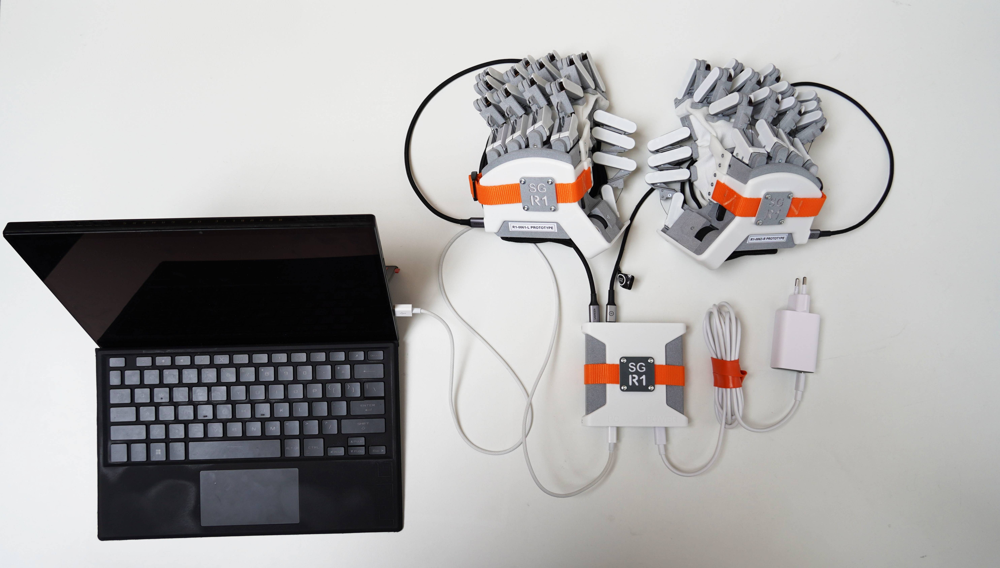

# Initial Setup



> [!NOTE]
> **Windows?** See [WSL setup](setup-wsl.md) to set up WSL2 first.

**1. Install ROS 2 & dependencies**

Follow the [ROS 2 installation guide](https://docs.ros.org/en/rolling/Installation.html) for your distro, then install:

```bash
sudo apt install -y python3-pip libxcb-cursor0
```

**2. Create workspace and Python venv**

```bash
mkdir -p ~/r1_ws/src
cd ~/r1_ws
python3 -m venv .venv
source ~/r1_ws/.venv/bin/activate && source /opt/ros/${ROS_DISTRO}/setup.bash
```

> [!TIP]
> Add a handy alias (run once):
>```bash
>echo "alias workonpython='source ~/r1_ws/.venv/bin/activate && source /opt/ros/\${ROS_DISTRO}/>setup.bash'" >> ~/.bashrc
>```

**3. Clone repositories**

```bash
cd ~/r1_ws/src
git clone https://github.com/Adjuvo/senseglove_r1_ros.git rembrandt_ros
git clone https://github.com/Adjuvo/SenseGlove-R1-API.git rembrandt-api
```

**4. Install Python dependencies**

```bash
pip install -r rembrandt_ros/requirements.txt
```

**5. Install the SG API**

```bash
cd ~/r1_ws/src/rembrandt-api
pip install -e .
```

**6. Build**

```bash
cd ~/r1_ws
colcon build --symlink-install
source install/setup.bash
```

## USB Access (udev rule)

To allow non-root USB access to the R1 glove:

```bash
echo 'SUBSYSTEM=="usb", ATTR{idVendor}=="2e8a", ATTR{idProduct}=="10f3", MODE="0666"' \
  | sudo tee /etc/udev/rules.d/99-r1-glove.rules
sudo udevadm control --reload-rules && sudo udevadm trigger
```